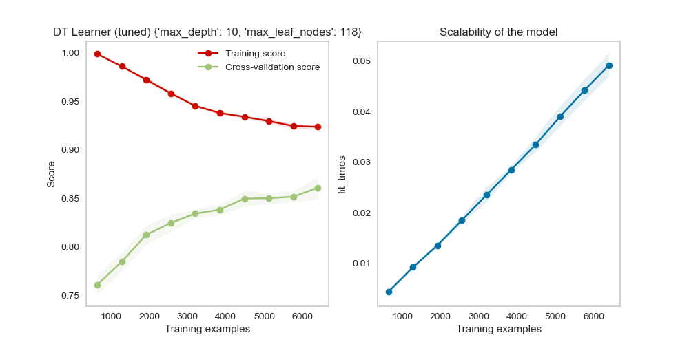
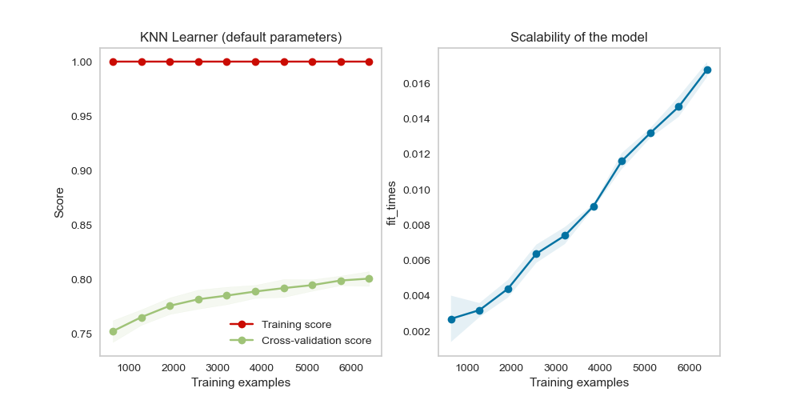
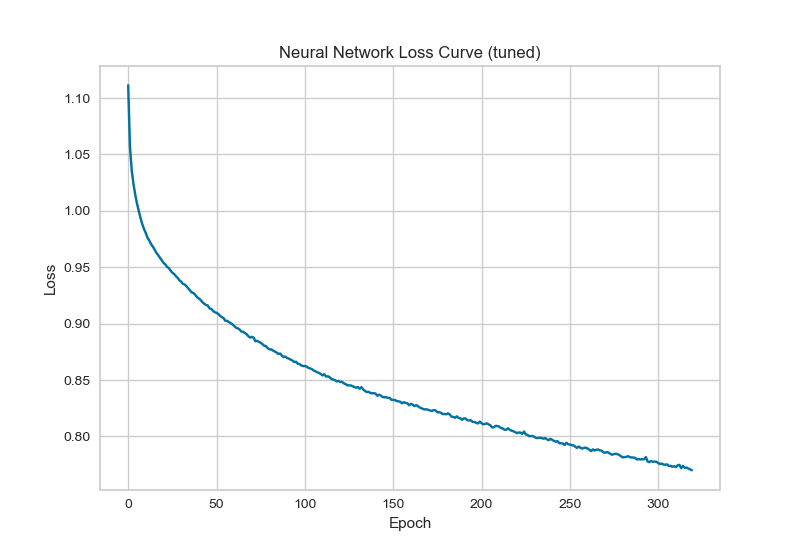
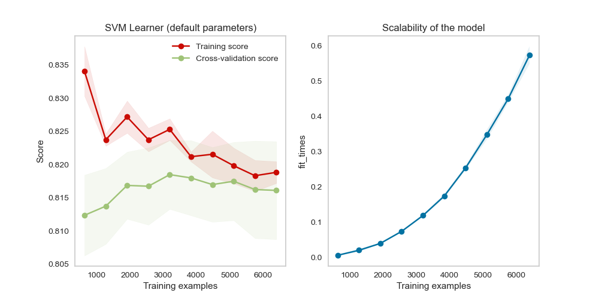

# Machine Learning: CS 7641 OMS
# Assignment 1 - Supervised Learning

Name: Austin Ard

GT ID: aard6

<!---
To generate a PDF:
pandoc report.md -s -o report.pdf -V fontsize=11pt
-->

## Introduction
This report will analyze and compare various supervised machine learning algorithms using two datasets: a bank loan dataset for classifying whether a customer would make a good candidate for receiving a loan, and a dataset for classifying stability of an electrical smart grid from various sensor readings. In order to make the bank loan dataset more interesting, the target class was changed from originally intended bank loan candidacy (binary) to the education level of the sample (3 classes). These data sets provide good contrast to one another: the bank loan dataset provides a multi-class classification problem with discrete features, and the smart grid dataset provides a binary classification problem with continuous features. The bank loan dataset also contains features with lots of outliers and unique samples, specifically customer IDs and zipcodes, whereas the smart grid dataset contains balanced features over various ranges. As such, the bank loan dataset will give us insight into algorithm performance with poor data set qualities, while the smart grid dataset will highlight higher quality dataset performance. Due to their contrasting nature, these datasets should expose some areas of weakness for each algorithm. All of the features in both data sets were standardized before experimentation. Some of the algorithms might be sensitive to feature scaling, so this eliminates any potential negative influences as a result while maintaining the integrity of the "apples-to-apples" comparisons of each algorithm.

| BANK LOAN DATA SET | Feature Distrubution | SMART GRID DATA SET | Feature Distribution |
| ---- | ---- | ---- | ---- |
| Education 1 | 2096 (42%) | Stable | 3620 (36%) |
| Education 2 | 1403 (28%) | Unstable | 6380 (64%) |
| Education 3 | 1501 (30%) |  |  |
| Total | 5000 | Total | 10000 |
| Attributes | 13 | Attributes | 12 |

## Decision Trees
This report uses the DecisionTreeClassifier from the sklearn Python module to analyze decision trees. The main hyperparameters used for tuning decision tree learners were max depth and max number of leaf nodes. The max depth defines how many layers the decision tree is allowed to go depth-wise, and the max number of leaf nodes defines the maximum number of leaf nodes. The default learners start with max depth of 1 and max leaf nodes of 2.

| Bank Loan Learning Curve (untuned)| Bank Loan Learning Curve (tuned) |
|:-------------------------:|:-------------------------:|
|{width=55%} | {width=55%}|

| Smart Grid Learning Curve (untuned)| Smart Grid Learning Curve (tuned) |
|:-------------------------:|:-------------------------:|
|{width=55%}|{width=55%}|

| Bank Loan MCC (tuned)| Bank Loan MCC (tuned) |
|:-------------------------:|:-------------------------:|
|{width=55%}|{width=55%}|

|Smart Grid MCC (tuned)| Smart Grid MCC (tuned) |
|:-------------------------:|:-------------------------:|
|{width=55%}|{width=55%}|

The default learners had high bias according to the untuned learning curves. Lower values of the chosen hyperparameters led to higher bias and underfitting, and higher values lead to higher variance and overfitting. At some point increasing max depth for a given max number of leaves had no effect, and vice versa. Decision trees also appear easy to underfit and hard to overfit since pushing the upper limits on hyperparameters increased variance but cross validation and testing scores still rose as well. Decision trees are not affected much by continuous versus discrete features because the decision tree can form leaf nodes using inequality logic to turn the continuous features into pseudo-discrete features. Since the bank data set is used for multiclass classification problem, it requires more nodes and depth to achieve a fitting solution as opposed to the binary classification problem associated with the smart grid dataset. Based on the good overall accuracies found with the bank loan dataset, decision trees are not sensitive to outliers. If a decision tree comes across an outlier, it can produce decision nodes that don’t put much, if any, weight on that outlier.

## K-Nearest Neighbors
This report uses the KNeighborsClassifier from the sklearn Python module to analyze K-nearest neighbor algorithms. The main hyperparameters used for tuning the K-nearest neighbors learners were number of neighbors (K) and weights. K indicates how many neighbors the algorithm will consider when classifying a new point, and the weights indicate the weight function used in predictions, with uniform giving equal weight to each point and distance giving weight based on the inverse of the distance between points.

| Bank Loan Learning Curve (untuned)| Bank Loan Learning Curve (tuned) |
|:-------------------------:|:-------------------------:|
|{width=55%} | {width=55%}|

| Smart Grid Learning Curve (untuned)| Smart Grid Learning Curve (tuned) |
|:-------------------------:|:-------------------------:|
|{width=55%}|{width=55%}|

| Bank Loan MCC (tuned)| Bank Loan MCC (tuned) |
|:-------------------------:|:-------------------------:|
|{width=55%}|{width=55%}|

|Smart Grid MCC (tuned)| Smart Grid MCC (tuned) |
|:-------------------------:|:-------------------------:|
|{width=55%}|{width=55%}|

The default learners had high variance according to the untuned learning curves. When the algorithm considers less neighbors, those neighbors have more influence on the classification of new points, which leads to overfitting to the training data avaiable. In order to tune these learners, these values of K were increased and evaluated against the different weight functions. The distance weight function led to more variance because the points were weighted more strongly as they got closer together, which would lead to overfitting to the training data used. Higher values of K lead to higher variance and overfitting and lower values of K lead to higher bias and underfitting. If the value of K increases, the algorithm will look for more neighbors when attempting classification which can oversimplify the problem, which is why higher values of K lead to higher bias. If the value of K decreases, the algorithm looks for less neighbors and becomes more sensitive to the training data used, increasing variance. The tuned KNN learner for the bank loan data set required higher number of neighbors (18) than for the smart grid dataset (8). Since the bank loan dataset has more unique values and outliers, the learner will need to consider more neighbors for the best tuned classification. The accuracy acheived by the bank loan learner was also significantly lower than the smart grid learner, indicating that K-nearest neighbors algorithms do not handle oultiers and imbalanced feature sets well. The presence of many outliers can easily skew the learners classification if those outliers get associated certain neighborhoods in the training data.

## Boosting
This report analyzes boosting algorithms using the ADABoostClassifier from the sklearn Python module. To maintain focus on the hyperparameters unique to the boosting algorithm, these experiments use the default base estimator of a decision tree classifier with max depth of 1. With such an aggressive pruning technique, these experiments use base estimators that would individually produce low accuracy results by themselves. The two hyperparmaters chosen for tuning and analysis were the number of estimators and the learning rate. The number of estimators defines how many base estimators the boosting algorithm runs in series to fit data, and the learning rate scales how much residual error is passed forward from previous estimators. The default learner used values of 1 for both.

| Bank Loan Learning Curve (untuned)| Bank Loan Learning Curve (tuned) |
|:-------------------------:|:-------------------------:|
|{width=55%} | {width=55%}|

| Smart Grid Learning Curve (untuned)| Smart Grid Learning Curve (tuned) |
|:-------------------------:|:-------------------------:|
|{width=55%}|{width=55%}|

| Bank Loan MCC (tuned)| Bank Loan MCC (tuned) |
|:-------------------------:|:-------------------------:|
|{width=55%}|{width=55%}|

|Smart Grid MCC (tuned)| Smart Grid MCC (tuned) |
|:-------------------------:|:-------------------------:|
|{width=55%}|{width=55%}|

The default learners had high bias according to the untuned learning curves. There is a tradeoff between n_estimators and learning rate. Increasing one without decreasing the other will lead to higher variance. Increasing learning rate reduced bias up to a certain point at a value slightly higher than 1, and increasing learning rate further started to increase bias significantly. Poor accuracy for the bank loan dataset indicates that boosting does poorly with outliers in data. Each separate estimator is trying to improve accuracy by learning from the previous estimator’s mistakes, so if the previous estimator makes a bad prediction based on an outlier, that will propagate forward and the algorithm focuses too hard on trying to get the outlier classified properly.

## Neural Networks
This report analyzes neural network algorithms using the MLPClassifier from the sklearn Python module. The main hyperparameters used for tuning and analysis were the hidden layer sizes and max iterations. The hidden layer sizes define how many hidden layers there are as well as how many nodes per hidden layer, and the max iterations defines the maximum number of epochs that the network uses to fit the training data. More epochs means that the entire training data set gets passed into the network for learning more times.

| Bank Loan Learning Curve (untuned)| Bank Loan Learning Curve (tuned) |
|:-------------------------:|:-------------------------:|
|{width=55%} | {width=55%}|

| Smart Grid Learning Curve (untuned)| Smart Grid Learning Curve (tuned) |
|:-------------------------:|:-------------------------:|
|{width=55%} | {width=55%}|

| Bank Loan MCC (tuned)| Bank Loan MCC (tuned) |
|:-------------------------:|:-------------------------:|
|{width=55%}|{width=55%}|

| Smart Grid MCC (tuned)| Smart Grid MCC (tuned) |
|:-------------------------:|:-------------------------:|
|{width=55%}|{width=55%}|

The default learners had high bias according to the untuned learning curves. Increasing the size and number of hidden layers increased variance. Increasing size of hidden layers allows the neural network to make more complex predictions with the training set which can lead to a better fit, but will overfit the data if too large. Lower numbers for max iterations (epochs) increases bias because this limits the neural network as to how many times it can adjust the fit for each data point in the training set. Having high numbers of max iterations leads to higher variance as the network is able to fit harder to the training set, which can also lead to overfitting if set too high. The accuracies of the bank loan data set were much lower than the smart grid accuracies, inidicating that neural networks are sensitive to dataset quality, with more outliers and imbalanced feature sets leading to poorer results.

| Bank Loan Loss Curve (tuned) | Smart Grid Loss Curve (tuned) |
|:-------------------------:|:-------------------------:|
|{width=55%} | {width=55%}|

Comparing the loss curve explains why the bank loan dataset required a higher value of max iterations. The loss reduction per epoch was much smaller than that of the smart grid dataset learner. This is a general illustration that the neural network had a harder time fitting to the bank loan data as a result of many outliers, imbalanced features, and its multi-class nature. This also led to high fit times since the network required more iterations to fit the data.

## Support Vector Machines
This report analyzes SVM algorithms using the SVC classifier from the sklearn Python module. The hyperparamaters chosen for tuning and analysis were the regularaization parameter C, gamma for the RBF kernel, and stopping tolerance for the linear kernel. The hyperparamater C influences how strong of a penalty the algorithm will assign for misclassified samples, with a higher C value issuing a stronger penalty. Gamma defines how far the influence of a training data point will reach, with a smaller gamma indicating a shorter range of influence.

### RBF Kernel
| Bank Loan Learning Curve (untuned)| Bank Loan Learning Curve (tuned)|
|:-------------------------:|:-------------------------:|
|{width=55%} |{width=55%}|

| Smart Grid Learning Curve (untuned)| Smart Grid Learning Curve (tuned) |
|:-------------------------:|:-------------------------:|
|{width=55%} | {width=55%}|

| Bank Loan MCC (tuned)| Bank Loan MCC (tuned) |
|:-------------------------:|:-------------------------:|
|{width=55%}|{width=55%}|

| Smart Grid MCC (tuned)| Smart Grid MCC (tuned) |
|:-------------------------:|:-------------------------:|
|{width=55%}|{width=55%}|

The default learners had high bias according to the untuned learning curves. Higher values of gamma resulted in support vectors whose influence didn't reach as far, causing the kernel to classify data points tighter together based on the training data, thus increasing variance. Lower values of C resulted in the algorithm assessing smaller penalties for misclassified data points in the training set, leading to higher bias. The bank loan dataset required larger values of C and gamma for the best tuning because it had less balanced features and more outliers, resulting in higher model complexity. Even with the more complex model, the bank data set learner resulted in significantly lower accuracies, highlighting the SVM classifier's weakness with data sets that contain outliers. The RBF kernel returned higher accuracies for both datasets when compared to the linear kernel. The linear kernel returned accuracies almost as high as the RBF kernel for the smart grid datset, indicating that its data was more linearly separable.

### Linear Kernel
| Bank Loan MCC (tuned)| Smart Grid MCC (tuned) |
|:-------------------------:|:-------------------------:|
|{width=55%}|{width=55%}|

The C hyperparameter had similar effects on the linear kernel as with the RBF kernel. The tolerance hyperparameter increased bias significantly for values greater than 1 due to oversimplification of the feature classifications. However, varying tolerance at levels below 1 had little to no effect on bias or variance, shown by the model complexity curves below. The overall accuracy of the linear kernel learners was lower than their RBF counterparts.

## Tuned Algorithm Comparison
| BANK LOAN DATA SET | Fit Time (s) | Accuracy | SMART GRID DATA SET | Fit Time (s) | Accuracy |
| ---- | ---- | ---- | ---- | ---- | ---- |
| Decision Tree | 0.01563 | 0.779 | Decision Tree | 0.0625 | 0.867 |
| KNN | 0.01563 | 0.483 | KNN | 0.0313 | 0.867 |
| Boosting | 0.60938 | 0.523 | Boosting | 0.875 | 0.849 |
| Neural | 57.60938 | 0.532 | Neural | 25.98438 | 0.958 |
| SVM | 1.01563 | 0.513 | SVM | 0.4688 | 0.969 |

All algorithms performed better for the smart grid dataset in terms of accuracy. This dataset was the easier classification problem with more balanced features and binary classification. The bank dataset was a more difficult classification problem with 3 class outputs instead of 2 and with more outliers and less balanced feature samples. This resulted in the tuned learners for this dataset requiring hyperparameters that defined more complex models for all algorithms. The decision tree accuracy was the highest for the bank loan dataset, indicating that it was the most robust to outliers and imbalanced features. The SVM had the highest accuracy for the smart grid dataset without having the longest fit times, showing that it performed the best with balanced datasets and continuous features. The SVMs outperformed the neural networks for the larger dataset, but not for the smaller dataset, indicating that SVMs scale better than neural networks with larger dataset sizes. The boosting algorithm performed poorly on both datasets relative to the other learners, but it's important to note that the boosting algorithm intentionally used decision trees with aggressive pre-pruning techniques as the base estimator. By using better tuned base estimators, the performance of the boosting algorithm would increase accordingly. Based on these analyses, below are the recommendations for using each of these algorithms.

**Decision Trees:** This would be the recommended algorithm when using lower quality datasets containing outliers and imbalanced features, as indicated by the highest overall accuracy with the bank loan dataset

**K-Nearest Neighbors:** This would be the recommended algorithm when looking for fast fit times with balanced datasets that don't contain outliers.

**Boosting:** This would not be the recommended algorithm if using poorly tuned base estimators

**Neural Networks:** This would not be the recommended algorithm for any situation. SVMs perform comparably to the neural networks for both low quality and high quality datasets.

**SVMs:** This would be the recommended algorithm when trying to acheive the highest possible accuracy with larger, high quality datasets, as indicated by the highest overall accuracy with the smart grid dataset.

# References
* Piazza discussions
* Modules/Lectures
* scikit-learn documentation
