# Machine Learning: CS 7641 OMS
# Assignment 2 - Randomized Optimization

Name: Austin Ard

GT ID: aard6

<!---
To generate a PDF:
pandoc report.md -s -o report.pdf -V fontsize=11pt
-->

## Introduction
This report will use the mlrose-hiive Python module to analyze the performance of 4 different local random search optimization algorithms: random hill climbing, simulated annealing, genetic algorithms, and MIMIC. Although not required, the random hill climbing will utilize restarts in order to maximize its effectiveness with the intent of comparing all algorithms in their best possible configurations. These algorithms will all be used to solve the knapsack problem, the four peaks problem, and the max k-colors problem. These optimization problems are unique and should highlight the strengths of various optimizers. The knapsack problem contains a search space with a large section resulting in a fitness score of 0 and few local optima, so simulated annealing should perform well on it. The four peaks problem has two primary local optima that have large basins of attraction and two global optima near the edge of the optimization space, so genetic algorithms should perform well on it. The max k-colors problem has the most expensive fitness function and an optimization space such that the structure of the values are more imortant than the actual values themselves, so the MIMIC algorithm should perform well on it. For simplicity, all problems will use bit strings of various lengths not to exceed 80 for their optimization spaces. In addition to these optimization problems, the simulated annealing, genetic, and MIMIC algorithms will be used for optimizing the weights of a neural network using the bank loan dataset from assignment 1. The main hyperparameter tuned for the algorithms was number of restarts for random hill climb, temperature for simulated annealing, and population size for both the genetic algorithm and MIMIC. Maximizing fitness and minimizing function evaluations was the primary focus of all hyperparameter tuning for both the optimization algorithms and the optimization problems. If multiple hyperparameters returned the best possible combinations of fitness and function evaluations, the hyperparameter that resulted in a less complex optimization problem was chosen due to Occam's razor.

## Knapsack Problem
The knapsack problem calculates fitness as the sum of products of the weight and value of items that do not exceed a threshold value, known as the knapsack capacity. Since a solution state that contains weights that exceed the knapsack capacity results in a fitness score of 0, there is a large part of the optimization space that forms a trench at the minimum fitness score. This trench and the lack of tricky local optima are the key features that should highlight the strengths of the simulated annealing algorithm. For tuning the knapsack problem, the main hyperparameter used was the max weight percentage. This value defines the capacity of the knapsack as a percentage of the sum of all the weights. Below are tuning plots for the knapsack problem using the optimizer that we expect to perform the best, which is simulated annealing.

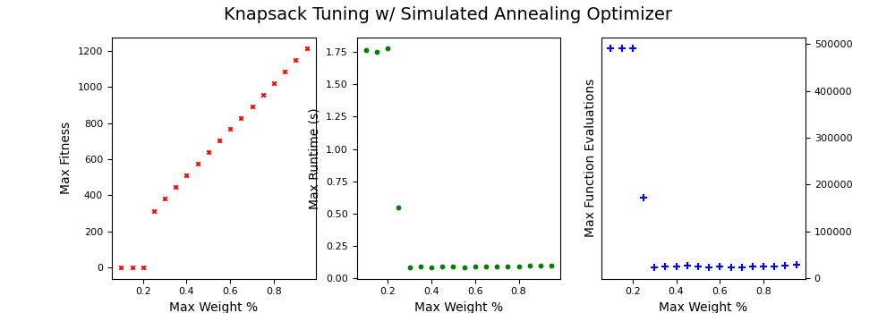

The max weight percentage chosen for analysis was 0.3 because it resulted in the shortest runtime and fewest function evaluations and still returned a good fitness. Hyperparameter tuning plots for all optimizers are shown below.

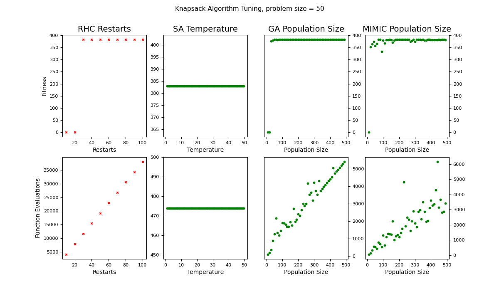

The simulated annealing returned max fitness for all values of temperature which highlights that there are no local optima that the simulated annealing can get stuck on, so a small value for temperature was chosen. Random hill climbing, genetic algorithm, and MIMIC all returned fitness values of 0 for the smallest values of their hyperparameters due to the trench in the search space. The plot below illustrates the complexity analysis of the knapsack problem for all optimizers. The optimizers were run on problems of varying size using the same hyperparameters tuned for a problem size of 50.

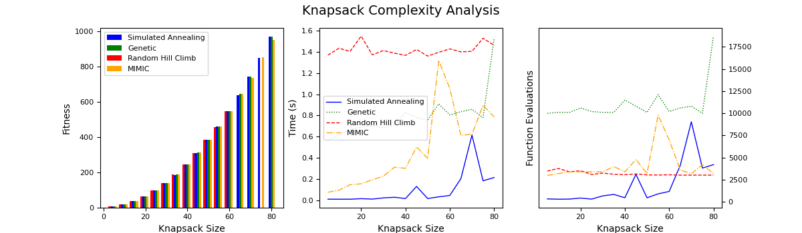

Random hill climb doesn't even find a solution with a fitness score greater than 0 for larger problem sizes because it gets stuck in the trench discussed previously. The genetic algorithm shows signs of struggling at higher problem sizes as indicated by its failure to produce a non-zero fitness score for size 70. MIMIC performs well by returning a high fitness solution, but also showed small signs of struggling at higher problem sizes by not returning a solution as high as simulated annealing. The largest problem size explored (80) looks like it will highlight the strengths of simulated annealing the best, so below are performance plots for that problem size.

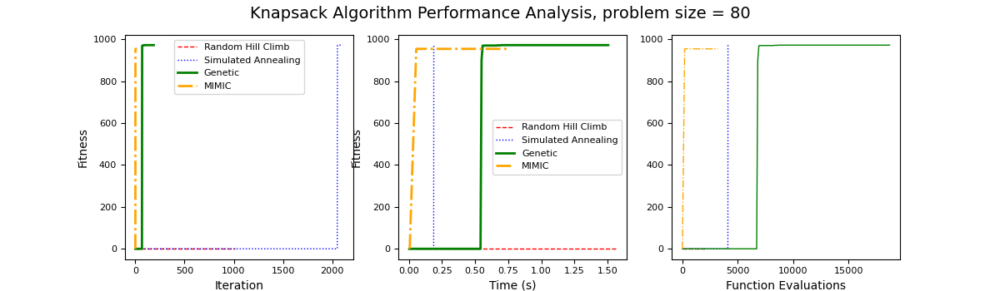

This plot illustrates the affects of the trench discussed previously by showing a fitness score of 0 at the beginning for each optimizer except for MIMIC. All the optimizers spend the majority of their runtime trying to escape the trench, and when they finally do, they return a good solution very quickly. Even though MIMIC escapes the trench quickly, it is unable to return the optimal solution due to its dependence on its own population. If we were to increase population size for MIMIC, eventually it would return the optimal solution, but the runtime would exceed that of simulated annealing. As expected, simulated annealing peformed the best on the knapsack problem by returning the optimal solution in a shorter runtime and smaller number of function evalutions when compared to the genetic algorithm, which was the only other optimizer to find the optimal solution. Simulated annealing would continue to outperform the other algorithms as problem size increases beyond the sizes analyzed in this report. Population based optimizers like genetic algorithms and MIMIC would perform progressively worse as problem size scaled up. In general, the knapsack problem highlights simulated annealing's strength when dealing with problems that do not have tricky local optima or large basins of attraction. In these types of problems, simulated annealing will return a great solution in a shorter amount of time than other optimizers.

## Four Peaks Problem
The four peaks problem calculates fitness by counting the number of leading 1's and the number of trailing 0's in the bit string, and adding the maximum of the two to the fitness score. However, if the length of both the leading 1's and the trailing 0's are greater than the threshold parameter, the fitness score gets a bonus equal to the length of the bit string. This creates a search space with four peaks: two of the peaks are local optima that contain a bit string with the maximum possbile length of either leading 1's or trailing 0's, and two global optima that contain maximum length of leading 1's and trailing 0's that also meet the bonus criteria of being longer than the threshold percentage. Genetic algorithms should perform well and be able to find the global optima despite the tricky local optima nearby. For tuning the four peaks problem, the threshold parameter was the primary hyperparameter tuned. Below are tuning plots for the four peaks problem using the optimizer that we expect to perform the best, which is the genetic algorithm.

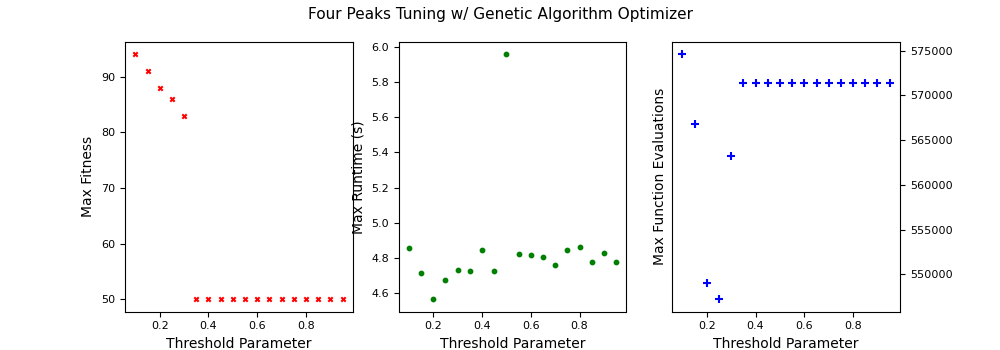

A threshold parameter of 0.35 was chosen as it resulted in the shortest runtime and smallest function evaluations while still returning a high fitness solution. The tuning plots for the main hyperparameters of each algorithm are below.

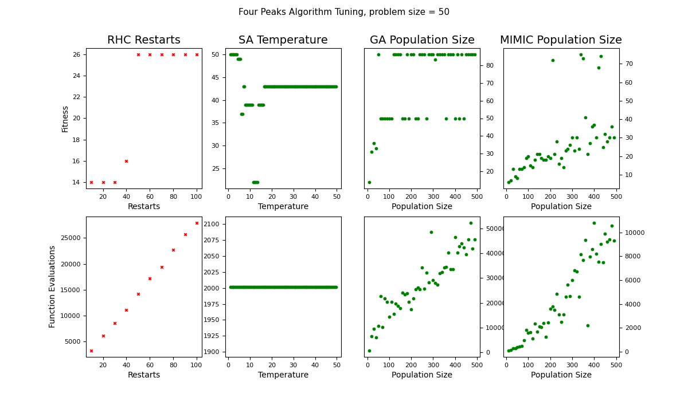

In general, increasing population size leads to better fitness for both genetic algorithms and MIMIC, which makes sense because this increases the chance that the randomly chosen populations have members that are close to the local optima. Increasing temperature for simulated annealing reduces fitness, indicating that the algorithm moves from the highest local optima to a lower local optima. The plot below illustrates the complexity analysis of the four peaks problem for all optimizers. The optimizers were run on problems of varying size using the same hyperparameters tuned for a problem size of 50.

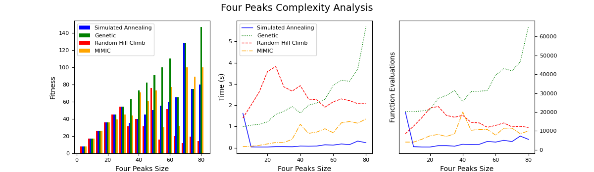

As problem size increases, the basins of attraction of the two local optima increase in size, which explains why algorithms sensitive to this effect struggle for problem sizes that are larger than the sizes for which they are tuned. Even though genetic algorithms appear to perform the strongest overall for varying problem sizes, there is still a stochastic element to its functionality that explains why it doesn't return the optimal solution every time. The largest problem size explored (80) looks like it will highlight the strengths of the genetic algorithm best, so below are performance plots for that problem size.

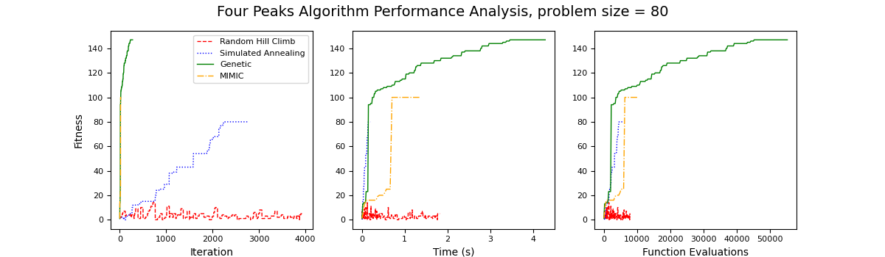

All four optimizers are able to find a solution. The random hill climbing has the hardest time finding even the local optima as expected. Simulated annealing algorithms return a decent solution, but it gets stuck on the local optima with large basins of attraction so they fall short of finding the global optima. Since the global optima and local optima are close to each other in the optimization space, the genetic algorithm's ability to mutate makes it easier to find the global optima, which is why it has the advantage in this problem. The function evaluation curve illustrates this effect well by showing that it reaches the local optima but is able to continue progressing towards the global optima while the other algorithms do not. The genetic algorithm here is the only algorithm that is able to locate the global optima on the edges of the optimization space thanks to its cross-breeding nature of the algorithm. Once it finds one of the local optima, the mutation and cross-breeding processes allow it to find the nearby global optima that other optimizers would not be able to find as easily, if at all. In general, the four peaks problem highlights genetic algorithms' strength in dealing with problems that contain tricky local optima with large basins of attraction since they are able to mutate out of getting stuck at the local optima.

## Max K-Colors Problem
The max k-colors problem calculates fitness by iterating over each node and adding up all the number of the nodes it is connected to that share its color. Here the value of the color is not what increases the score, but rather the number of nodes that are connected to other nodes of a similar color, meaning the structure of the problem holds much more value than the actual color values themselves. This problem also has the most computationally difficult fitness function of all three optimization problems in this reprot, so minimizing the number of function evaluations will the most impact here. The MIMIC algorithm performs well with problems in which structure is important and problems with computationally expensive fitness functions, so it is expected to perform the best on this problem. For tuning the max k-colors problem, the main hyperparameter used was the maximum number of edges connected to each node. Below are tuning plots using the optimizer that we expect to perform the best, which is MIMIC.

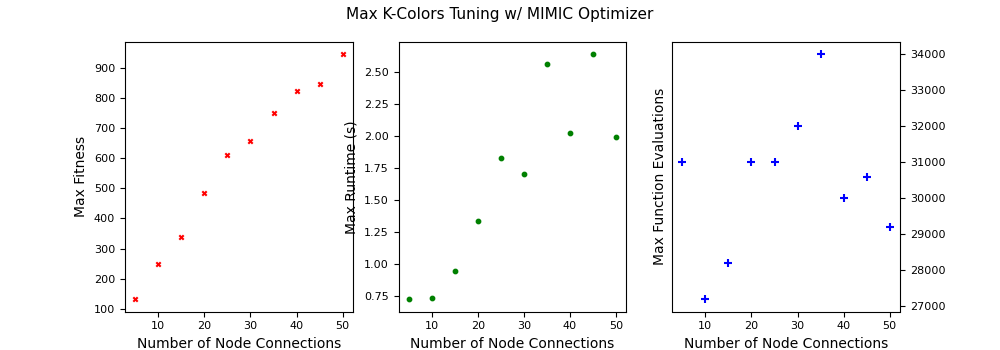

The maximum fitness scales with the number of max node connections, so we set the max node connections to equal the problem size so that they scale together. Below are tuning plots for each individual algorithm.

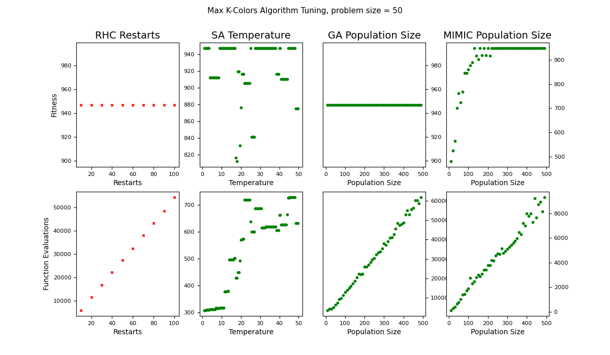

Hyperparameters have the smallest effect for most of the algorithms on the max k-colors problem which shows that the search space doesn't have many tricky areas, meaning it is probably the easiest in terms of finding the optimal solution. The only hyperparameter that really seems to have an affect on performance is MIMIC's population size, which makes sense because larger population size increases the chance that MIMIC actually samples the global optima into its population. Genetic algorithm is not sensitive to this since it can always mutate into the global optima. The plot below illustrates the complexity analysis of the max k-colors for all optimizers. The optimizers were run on problems of varying size using the same hyperparameters tuned for a problem size of 50.

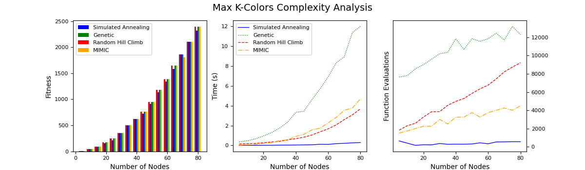

All algorithms return similar solutions for all problem sizes most likely because there aren't many local optima for the algorithms to get stuck on. The key to the best performance on this problem will be which algorithm can identify the global optima the quickest. The largest problem size explored (80) should highlight the strengths of the MIMIC algorithm best because it returns the best solution in the fewest number of function evaluations, so below are performance plots for that problem size.

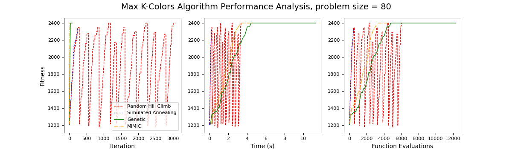

The MIMIC algorithm does well with problems in which structure is important since it can retain knowledge of the structure between iterations, whereas the other algorithms care only about the fitness value. For optimizing this problem, the optimal choice will be that all values of the node colors are the same, whether they are 0's or 1's. MIMIC picks up on this and finds the solution in far fewer function evaluations, while the other three optimizers are more interested in changing the individual color values exhaustively. Since keeping the values of all the nodes the same color results in the max fitness, the mutation capability of the genetic algorithm could actually be hurting its ability to find the global optima by changing a color from the majority value to the minority value. In general, the max k-colors problem highlights MIMIC's strength when dealing with problems in which structure of the state is more important than the individual values of the state due to its use of probablitity distributions to pass information about the structure of the search space between iterations.

## Neural Networks
Here we will evaluate the ability of randomized optimizers to optimize the weights of a neural network using the bank loan dataset from assignment 1. The bank loan dataset was chosen because the back propagation neural network from assignment 1 resulted in high accuracy, which gives us a good benchmark to evaluate if the randomized optimizers can also perform that well. The three optimizers explored will be random hill climbing, simulated annealing, and genetic algorithms. We expect to see different results between the back propagation algorithm and the randomized optimization algorithms. The search space for neural network weights is much larger than the bit string search spaces explored earlier in this report, and the values of the weights are continous instead of discrete. All of the randomized optimizers were tuned using the same hyperparameters used throughout this report, with plots below.

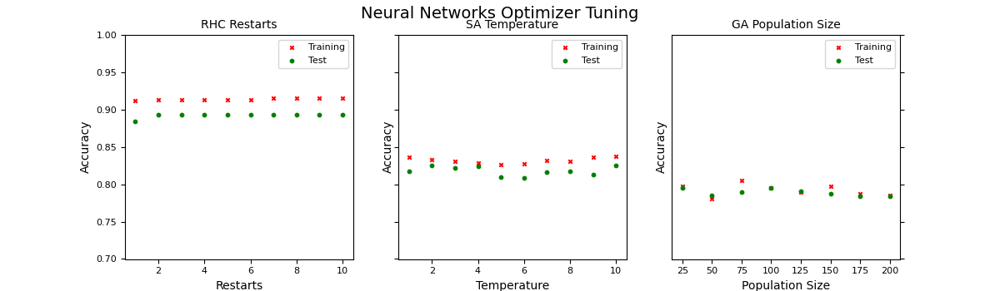

The tuning parameters searched don't have a huge affect on accuracy, so we choose values that simplify the algorithm due to Occam's razor. This strategy should also reduce runtime. Searching for hyperparameters with higher values for each optimizer would probably increase accuracy, but the tradeoff for runtime would not be worth it. Below are learning curves and loss curves for all the tuned optimizers.

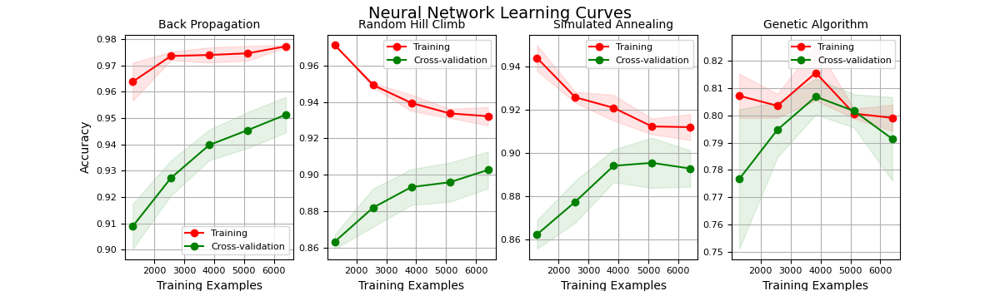

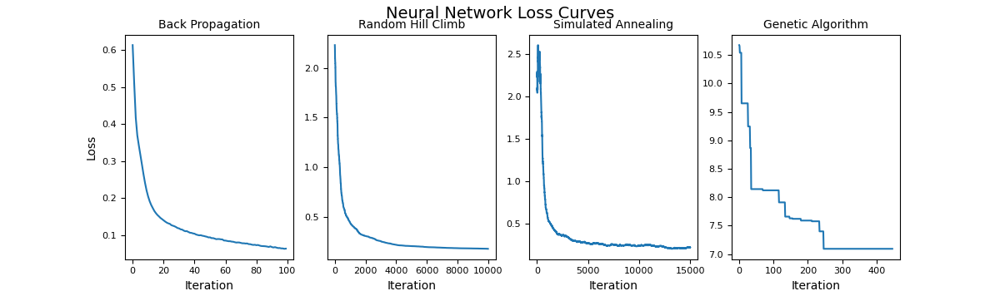

| Weight Optimizer | Fit Time (s) | Predict Time (s) | Loss |
| ---- | ---- | ---- | ---- |
| Back Propagation | 2.38 | 0.00099 | 0.0640 |
| Random Hill Climb | 414.72 | 0.00299 | 0.1741 |
| Simulated Annealing | 303.21 | 0.00303 | 0.2218 |
| Genetic Algorithm | 557.26 | 0.00200 | 7.0935 |

Back propagation returns higher accuracy and lower loss in fewer iterations than all of the randomized optimizers. The back propagation algorithm uses gradient information and is designed to work with continous values whereas the randomized optimizers are designed to work with discrete values, so it is not surprising that it performs better. The mlrose implementation of these randomized optimizers has to discretize the search space which also increases run time. The fact that the bank loan dataset is rather large with 10000 samples further exaggerates the weakness of any optimizers with long runtimes. Random hill climbing returns the highest accuracy and lowest loss out of the three randomzied optimizers because it is able to search the widest range of the search space due to its random restarting. Simulated annealing returns decent accuracy but runs the fastest which makes sense because it searches similar to random hill climbing but without restarting. Both random hill climbing and simulated annealing take significantly more iterations becuase they change the weights one at a time rather than all at once. The genetic algorithm performs the worst in terms of accuracy, loss, and fit time, partially because the tuning process put heavy emphasis on runtime. The learning curve shows high bias in the genetic algorithm neural network meaning it is not fitting the data well. The genetic algorithm is less likely to mutate to a stronger weight simply because the range of possible weight values is much higher than with discrete bit-strings. Genetic algorithm would most likely would return better accuracy and loss with larger population sizes, but the runtime would grow so much that the tradeoff wouldn't be worth it.

## Conclusion
In conclusion, the random optimizers explored in this report are all effective ways of tackling optimization problems, and the best optimizer to choose really depends on the fitness function. For fitness functions that do not contain many local optima and are cheap to calculate, simulated annealing is a great choice. For problems in which there are global optima that can be tricky to find, genetic algorithms are a great choice. For problems in which the structure of the fitness function is important or the fitness function is expensive to calculate, MIMIC is a great choice. For optimizing the weights of a neural network, the randomized optimizers would only be a feasible choice over back propagation if the weights were discrete instead of continuous and limited to smaller ranges of possible values. If I had more time, I would first explore larger problems. The problem sizes were chosen with the intent to keep runtimes at reasonable levels while keeping the problems interesting, so exploring much larger problem sizes would hopefully further highlight the strengths and weaknesses of the optimizers. I would also explore more complex fitness functions to hopefully highlight the impact of minimizing the number of fitness evaluations when the fitness function is computationally difficult to calculate. I would also dive deeper into tuning the hyperparameters for the random optimizers when using them for weight optimiziation in the neural networks and explore hyperparameters that resulted in longer runtimes.

# References
* mlrose documentation/examples
* Piazza discussions/Office Hour notes
* Modules/Lectures
* Randomized Local Search as Successive Estimation of Probability Densities, Charles L. Isbell, Jr
* Simulated Annealing and the Knapsack Problem, Benjamin Misch
* Removing the Genetics from the Standard Genetic Algorithm, Shumeet Baluja & Rich Caruana