# Machine Learning: CS 7641 OMS
# Assignment 3 - Unsupervised Learning and Dimensionality Reduction

Name: Austin Ard  &nbsp;&nbsp;&nbsp;&nbsp;      GT ID: aard6

<!---
To generate a PDF:
pandoc report.md -s -o report.pdf -V fontsize=11pt
-->

## Introduction
This report will use the sklearn Python module to analyze the performance of 2 unsupervised clustering algorithms (K-Means Clusters and Expectation Maximization) and 4 dimensionality reduction algorithms (Principal Component Analysis, Independent Component Analysis, Random Projection, and Factor Analysis). These algorithms will all be analyzed independently as well as in tandem with all possible combinations of clustering and dimensionality reduction algorithms. This report will use the same two datasets analyzed in assignment1: a smart grid stability dataset and a bank loan qualification dataset. These datasets were chosen due to their contrasting nature, where the smart grid dataset has all continuous, well balanced, and evenly distributed features, and the bank loan dataset contains mostly discrete features with a ton of outliers. These algorithms will also be run prior to feeding the dataset into the same neural network from assignemnt 1 for comparison.

## Clustering

The first part of this report will explore the 2 different clustering algorithms discussed in the introduction, as well as illustrate the process used for selecting the optimal number of clusters for each.

### K-Means Clustering

K-Means clustering assigns samples to spherical clusters based on a similarity metric. For simplicity's sake, we use the euclidean distance metric for this experiment. Three metrics to evaluate these clusters are the silhouette score, Calinksi-Harabasz score, and the Davies-Bouldin score. The silhouette score is a metric calculated for each sample using its mean nearest cluster-distance and mean intra-cluster distance, where a higher score indicates that the sample is closer to its assigned cluster and farther away from the other clusters. The Calinksi-Harabasz score is a metric that highlights the ratio between how spread out points are within each cluster and how spread out clusters are from each other, so a higher score indicates that the clusters are tigher together and further apart from each other. The Davies-Bouldin score is a metric that highlights the ratio of intracluster scattering and intercluster separation, so a lower score indicates that the clusters are tighter together and further apart from each other. This analysis only concerns itself with relative scores between models, so the CH and DB scores were scaled down to fit on the same plot with the silhouette score for visual analysis. The results below illustrates the selection process for the number of clusters (K) aned the validation of those clusters against a base boosting learner.

| Selection Method | # of Clusters | Boosting Fit Time (s) | Boosting CV Score | # of Clusters | Boosting Fit Time (s) | Boosting CV Score |
| ---- | ---- | ---- | ---- | ---- | ---- | ---- |
| Base Learner | | 2.002 | 0.846 | | 0.397 | 0.499 |
| Best Scores | 2 | 1.509 | 0.996 | 3 | 0.408 | 0.920 |

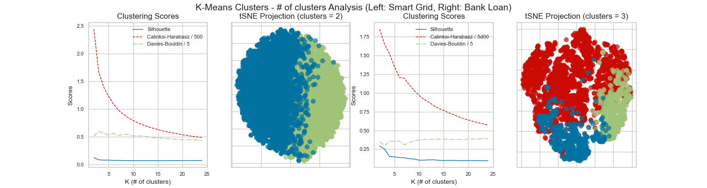

When choosing the best combination of metric scores, we select a best number of clusters that is small compared to the range of cluster quantities explored. The clustering increased cross-validation accuracy significantly for the boosting learners for both datasets. Since this method is a form of pre-processing before passing into the boosting learner, it essentially boosts the booster. The fit time for the base learner also decreased for the larger smart grid dataset, but the fit time remained relatively the same for the smaller bank loan dataset. This highlights the increased effect of clustering on reducing runtime in correlation with dataset size, meaning there is more value when performing K-means on datasets of increasing size.

### Expectation Maximization (EM)

The EM algorithm assigns samples to clusters assuming that the clusters take the form of Gaussian distributions instead of spherical clusters like K-means. The two metrics used to evaluate these clusters were the Bayesian Information Criterion (BIC) and Akaike Information Criteria (AIC). Both scores are driven down by increasing maximum likelihood estimates, with a lower score indicating a better fit. The main difference between the two is that BIC puts a higher penalty on more complex models. When validating the number of components for EM against a base boosting learner, low cross-validation accuracies were output when choosing the minimum point of both AIC and BIC scores. These values usually indicated that number of components should be high. However, this was most likely resulting in an model overfitting to the training data. To supplement these findings with a new selection method, using an elbow method of choosing the point of maximum curvatures for the metric curves was also explored. Below is a table and plot with results from this experiment. The values on the left of the table are for the smart grid dataset, and the values on the right are for the bank loan dataset.

| Selection Method | # of Clusters | Boosting Fit Time (s) | Boosting CV Score | # of Clusters | Boosting Fit Time (s) | Boosting CV Score |
| ---- | ---- | ---- | ---- | ---- | ---- | ---- |
| Base Learner | | 2.140 | 0.846 | | 0.397 | 0.499 |
| Lowest | 3 | 1.363 | 0.879 | 28 | 0.676 | 0.260 |
| Elbow | 3 | 1.363 | 0.879 | 6 | 0.484 | 0.799 |

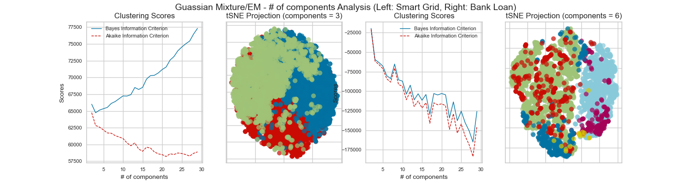

When validating against a base classifier, using the elbow method results in far better cross-validation accuracy as it chooses a less complex model that doesn't overfit to the data. Interestingly, both selection methods resulted in the same number of components for the smart grid dataset. In fact, the metric curve plot above shows that BIC increases with number of components rather than decreasing alongside AIC like with the bank loan dataset. The key reason for this is the smart grid dataset is the larger of the two and the fact that BIC penalizes more complex models more so than AIC does. Both scores have a constant value added to the maximum likelihood estimate portion of the score formula, however the BIC score calculates this score with respect to the number of samples while AIC does not. Since the smart grid dataset has twice as many samples as the bank loan dataset, it gets increasingly more penalized via this constant term as number of components increases. From this observation, we see the affect that dataset size has on component number selection and that using the base method of selecting the lowest metric scores loses credibility with increasing dataset size. This experiment also suggests that selecting the point of maximum curvatures is a more consistent method for choosing a good solution with varying dataset size. The fit time for the base learner significantly decreased for the larger smart grid dataset after performing EM, whereas the fit time remained relatively the same for the smaller bank loan dataset. This highlights the increased effect of clustering on reducing runtime in correlation with dataset size as well, meaning there is more value when performing clustering method like EM on datasets of increasing size.

## Dimensionality Reduction

The next part of this report will explore the 4 different dimensionality reduction algorithms discussed in the introduction, as well as illustrate the process used for selecting the optimal number of reduced features for each.

### Principal Component Analysis (PCA)

For PCA component selection, we will look at the variances of each new component as well as their sums. This is a good measure of PCA's performance because PCA aims to find components by maximizing their variance, which should result in features that provide more value to the learning algorithm. To analyze the new components generated by PCA versus the original features, we look at the variance of each component/feature in relation to each other. The plots below show the results of these experiments.

| DR Algorithm | # of Features | Boosting Fit Time (s) | Boosting CV Score | # of Clusters | Boosting Fit Time (s) | Boosting CV Score |
| ---- | ---- | ---- | ---- | ---- | ---- | ---- |
| None | 12 | 1.923 | 0.846 | 13 | 0.526 | 0.499 |
| PCA | 11 | 1.642 | 0.836 | 9 | 0.567 | 0.445 |

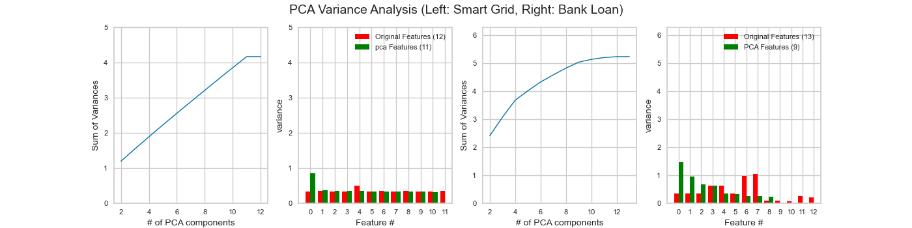

As the number of components decreases, the sum of variance deacreases for both datasets, which makes sense because variance in the overall data will decrease with less datapoints. This decrease is close to linear for the smart grid dataset, indicating that the features all have similar variances and are well distributed internally. The bank data set has more of a curve to it, inidicating that there are a few features which provide very little variance, which is why PCA is able to eliminate more components while maintaining good overall variance. The feature/PCA component bar graphs show that while projecting to a new space, the variance increases for some of the new PCA components as expected considering it tries to maximize variance among components. It also illustrates why PCA is able to remove certain original features due to low variances wile mainting a good overall variance as shown by the max PCA component variance being higher than the highest original feature variance.

### Independent Component Analysis (ICA)

For ICA component selection, we look at the kurtosis values for each new component as well as their mean. This is a good measure of ICA's performance because a higher kurtosis value would indicate that the components are statistically independent, and ICA tries to find components by maximizing independency. To analyze the new components generated by ICA versus the original features, we look at the kurtosis of each component/feature in relation to each other.

| DR Algorithm | # of Features | Boosting Fit Time (s) | Boosting CV Score | # of Clusters | Boosting Fit Time (s) | Boosting CV Score |
| ---- | ---- | ---- | ---- | ---- | ---- | ---- |
| None | 12 | 1.923 | 0.846 | 13 | 0.526 | 0.499 |
| ICA | 11 | 1.676 | 0.849 | 4 | 0.316 | 0.436 |

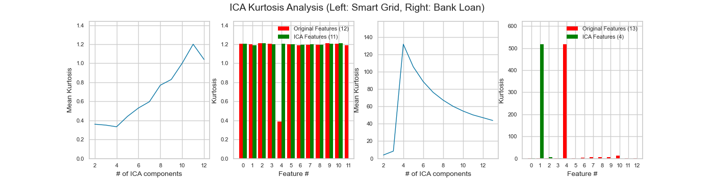

The smart grid dataset shows original features with relatively equal kurtoses, which is expected considering it mostly contains well balanced and evenly distributed features. In this case, ICA notices the one original feature with less kurtosis than the rest and projects the data to a space in which that kurtosis gets distributed to the other components, which also results in that component ultimately getting eliminated. We can infer from this that ICA would not have large impacts on datasets that contain balanced and well behaved features. For the bank loan dataset which contains features with high kurtosis as well as one feature that has significantly higher kurtosis than all the others, the ICA algorithm prefers to reduce a much larger number of components. In other words, ICA chooses to let the high kurtosis feature remain the same and lets it dominate the overall kurtosis of the model while also removing spme of the smaller kurtosis components. This process proves effective, as the cross-validation score of the base boosting learner does not diminish by much in the process while still managing to reduce runtime.

### Random Projection (RP)

RP is similar to PCA, however RP selects the new component axes randomly as opposed to trying to maximize variance. For RP component selection, we look at the reconstruction error values for each new component. This will be a good measure of RP's performance because it highlights how far away the random component axes are from the original features, which RP would hopefully minimize. Since the reconstruction error decreases somewhat linearly with increased number of reduced componenets, we set a threshold on 10% reconstruction error when selecting number of components. Since both datasets have just over 10 features to begin with, this should correlate to roughly 1 feature being reconstructed poorly, and we assume that component will be eliminated anyways. To analyze the new components generated by RP versus the original features, we look at the variance of each component/feature in relation to each other.

| DR Algorithm | # of Features | Boosting Fit Time (s) | Boosting CV Score | # of Clusters | Boosting Fit Time (s) | Boosting CV Score |
| ---- | ---- | ---- | ---- | ---- | ---- | ---- |
| None | 12 | 1.923 | 0.846 | 13 | 0.526 | 0.499 |
| RP | 10 | 1.712 | 0.819 | 9 | 0.382 | 0.476 |

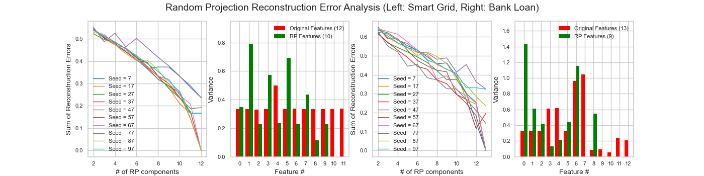

Reconstruction error decreases as the number of reduced compnents increases as expected because there would be smaller reconstruction error as you approach the same number of reduced components as original features. Similarly to PCA, we can see that RP projects the data into a new space that results in variance being higher for some individual components while also elminating the components whose variances are being reduced as a result, as shown by the variance plots. Cross-validation scores for the base learner are comparable to the scores returned by the PCA reduction analyzed earlier, which indicates that the random projection of new components works almost as well as actually calculating certain values for these new components such as variance. This suggests that random projection is a valid method for reducting dimensionality espeically when datasets become larger and variance calculations become more costly.

### Factor Analysis (FA)
FA is similar to PCA, however FA attempts to find correlations between features based on an underlying latent factor rather than looking to maximize component variance. For FA component selection, we will look at the variances of each new component as well as their sums. This will be a good metric to compare this algorithm to PCA because of their similarity. To analyze the new components generated by FA versus the original features, we look at the variance of each component/feature in relation to each other.
Factor analysis is similar to PCA, however

| DR Algorithm | # of Features | Boosting Fit Time (s) | Boosting CV Score | # of Clusters | Boosting Fit Time (s) | Boosting CV Score |
| ---- | ---- | ---- | ---- | ---- | ---- | ---- |
| None | 12 | 1.923 | 0.846 | 13 | 0.526 | 0.499 |
| FA | 6 | 1.179 | 0.771 | 7 | 0.376 | 0.449 |

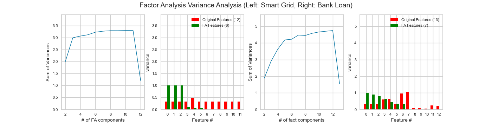

FA returns a relatively low cross-validation score for the smart grid dataset compared to other DR algorithms. The smart grid dataset contains features that are sensor readings of an electrical grid, and the classification label is whether or not the grid is unstable. Factor analysis would try to find correlations based on some underlying factors influencing the readings. In other words, factor analysis works best when the classification labels influence the features, not the other way around. The smart grid isn't becoming unstable because of the sensor values, rather the sensor values are changing because the smart grid is in unstable. Due to this fundamental difference in how the dataset's features and class labels interact versus how factor analysis works, the factor analysis algorithm reduces much more features than it probably should and results in poor accuracies for this dataset. Regardless, FA still reduces runtime for both datasets, indicating it is a feasible method for cutting back on computational cost regardless of

### Dimensionality Reduction Runtime Analysis

Below are the fit times for each of the DR algorithms for comparison against each other.

| DR Algorithm | Smart Grid Fit Time (s) | Bank Loan Fit Time (s) |
| ---- | ---- | ---- | ---- |
| PCA | 0.0029 | 0.00391 |
| ICA | 0.234 | 0.00781 |
| RP | 0.00098 | 0.00042 |
| FA | 0.798 | 1.192 |

As expected, RP is the fastest because it is easy and fast by just choosing a random projection and going with it. FA was the slowest, which also makes sense because the algorithm performs more calculations trying to indentify the underlying factor's affect on the features as well as projecting the features to a new space. Overall, all the algorithms run at reasonable times relative to some of the fit times for the base boosting learners used for validation in this report, meaning that they would all be reasonable

##  Dimesionality Reduction + Clustering

The next experiment involved running the datasets through each dimensionality reduction algorithm prior to running them through each clustering algorithm. After running each combination of dimensionality reduction and clustering algorithm, each resulting transformed data set was run through a basic boosting learner for cross-validation score comparison. Boosting was chosen due to its ability to perform well with minimal tuning while also minimizing the possibility of overfitting. Below is a table containing the results, with values on the left side corresponding to the smart grid dataset, and values on the right side corresponding to the bank loan dataset.

| DR Algorithm | Cluster Algorithm | # of Clusters | Boosting Fit Time (s) | Boosting CV Score | # of Clusters | Boosting Fit Time (s) | Boosting CV Score |
| ---- | ---- | ---- | ---- | ---- | ---- | ---- | ---- |
| PCA | None | | 1.872 | 0.835 | | 0.619 | 0.445 |
| PCA | K-Means | 2 | 0.971 | 0.998 | 3 | 0.460 | 0.932 |
| PCA | EM | 3 | 1.362 | 0.916 | 4 | 0.638 | 0.868 |
| ICA | None | | 1.968 | 0.849 | | 0.351 | 0.436 |
| ICA | K-Means | 3 | 1.006 | 0.885 | 5 | 0.315 | 0.802 |
| ICA | EM | 3 | 1.441 | 0.897 | 6 | 0.410 | 0.470 |
| RP | None | | 1.611 | 0.819 | | 0.428 | 0.476 |
| RP | K-Means | 2 | 0.988 | 0.972 | 2 | 0.400 | 0.986 |
| RP | EM | 3 | 1.282 | 0.847 | 5 | 0.538 | 0.664 |
| FA | None | | 1.109 | 0.771 | | 0.379 | 0.449 |
| FA | K-Means | 6 | 0.693 | 0.730 | 5 | 0.397 | 0.889 |
| FA | EM | 5 | 0.891 | 0.773 | 6 | 0.516 | 0.825 |

Almost all combinations result in faster fit times for the boosting learner as expected. For both datasets, K-means increases accuracy while also reducing runtime for almost every combination. For the bank loan dataset, the k-means algorithm in combination with all of the dimensionality reduction algorithms causes accuracy to increase significantly, usually on the order of 50 percentage points. Even though this dataset was chosen specifically for its ability to trick classifiers with many outliers and imbalanced features that don't conform to much of a pattern, the combination of reducing dimensions followed by K-means reworks the dataset into a more manageable form that isn't as tricky for classifiers. However, the EM algorithm in cominbation with dimensionality doesn't improve accuracy, and in some cases actually lowers it. This is a result of the EM algorithm trying to focus on the distributions of the features, which all of the DR algorithms either directly or indirectly change. For both the factor analysis combinations, the bank loan dataset returned higher cross-validation accuracies than the smart grid dataset. Below is a plot showing these results.

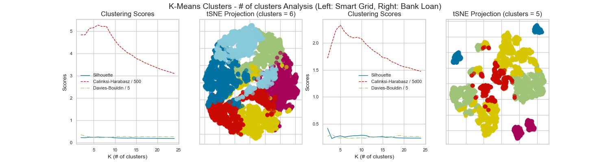

This poor performance is shown in the tSNE projections, in which the clusters for the bank loan dataset look tighter and more spread apart than those of the smart grid dataset. This behavior is most likely a result of the FA calculation method discussed earlier that doesn't work well with the smart grid dataset. Even after passing the poorly reduced dataset into the clustering algorithm, the resulting accuracies remain low. This tells us that if the dimensionality reduction algorithm doesn't perform well on a given dataset, then even a well performing clustering algorithm won't be able to make up for the decreaed model performance.

The RP combination with k-means returned the highest accuracy for the bank loan dataset. Below is a plot showing these results.

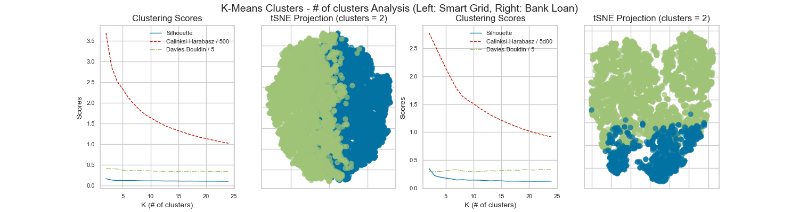

Both clustering algorithms end up returning the smallest number of clusters inspected for both datasets, showing us that random projection can actually project the data in a way that makes it easy for clustering algorithms to work with. These results suggests that the bank loan dataset in its original form is difficult for learners to tackle, but a simple projection in other directions (in this case, random directions) provides a new perspective for the learner to observe, which ends up leading to significantly better accuracies. Although this process works out well in this particular case, considering the stochastic nature of the algorithm, it would be bold to assume that this RP + clustering combination would promote such a high increase in accuracies in all cases.

The ICA and EM combination is interesting because of how both algorithms operate contrastingly. ICA attempts to project new components that have a high degree of non-Gaussianity (high kurtosis) and the EM algorithm is actually trying to form clusters based on Gaussian distributions. This resulted in relatively poor accuracies for the smart grid dataset, but an especially poor cross-validation score for the bank loan dataset. Below is a plot showing these results.

These results indicate that the smart grid dataset is better suited to work with this combination of algorithms due to its features being more Gaussian by nature in the first place in that they are more evenly distributed with less outliers. Even with this underlying nature, the contrasting algorithms reduce model performance. This resulting poor model performance is especially apparent in the bank loan dataset, which does not have Guassian features, where the accuracy returned is the lowest of all combinations.

## Neural Networks

This analysis will compare the performance of the neural network from assignment 1 against a neural network run after dimensionality reduction and clustering is performed with the smart grid dataset. The first experiment here will look at the dimensionality reduction and neural network combination first. Below are results for this experiment.

| Dimensionality Reduction | # of Features | Fit Time (s) | Accuracy | Loss |
| ---- | ---- | ---- | ---- |
| None (A1 Learner) | 12 | 3.68 | 0.958 | 0.064 |
| PCA | 11 | 2.38 | 0.957 | 0.053 |
| ICA | 11 | 1.42 | 0.810 | 0.390 |
| RP | 11 | 3.58 | 0.924 | 0.141 |
| FA | 6 | 2.63 | 0.772 | 0.435 |

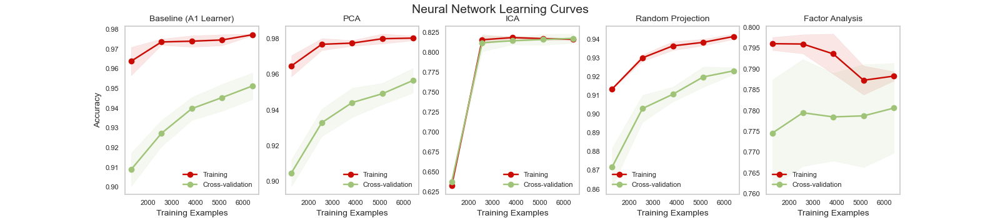
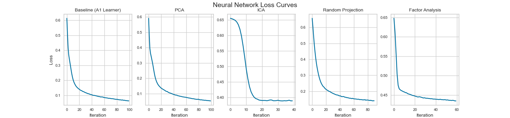

Fit times suggest that neural networks are more sensitive to the distribution of features rather than the number of features. For example, the ICA reduced training set resulted in a faster runtime than both PCA and RP for the same number of reduced features, indicating that the neural network is able to learn with statistically independent datasets more quickly. However, PCA and RP resulted in better classification accuracies, indicating that features selected based on maximizing variance is preferred when higher accuracy is more important than runtime. Factor analysis performs comparably to PCA and ICA in terms of runtime, but returns the lowest accuracy. This is partially because factor analysis reduced the number of features the most, but also because of how the factor analysis algorithm works. The smart grid dataset contains features that are sensor readings of an electrical grid, and the classification label is whether or not the grid is unstable. Factor analysis would try to find correlations based on some underlying factors influencing the readings. In other words, factor analysis works best when the classification labels influence the features, not the other way around. The smart grid isn't becoming unstable because of the sensor values, rather the sensor values are changing because the smart grid is in unstable. Due to this fundamental difference in how the dataset's features and class labels interact versus how factor analysis works, the factor analysis algorithm reduces much more features than it probably should and results in poor accuracies.

The final experiment analyzed the effects of using a clustering algorithm to reduce the number of features in a dataset prior to feeding into a neural network. This experiment involved first removing a set number of features with the lowest variance (as identified in the earlier dimensionality reduction analysis) and inserting a new feature containing the output cluster labels from each clustering algorithm. The results are in the table below.

| Clustering | Reduced Features | Fit Time (s) | Accuracy | Loss |
| ---- | ---- | ---- | ---- |
| None (A1 Learner) | 0 | 2.449 | 0.958 | 0.064 |
| K-Means | 1 | 1.804 | 0.890 | 0.223 |
| EM | 1 | 1.815 | 0.887 | 0.0.217 |
| K-Means | 2 | 2.019 | 0.850 | 0.311 |
| EM | 2 | 1.671 | 0.844 | 0.312 |
| K-Means | 3 | 1.912 | 0.808 | 0.278 |
| EM | 3 | 1.802 | 0.802 | 0.379 |
| K-Means | 4 | 1.839 | 0.781 | 0.443 |
| EM | 4 | 1.656 | 0.781 | 0.444 |
| K-Means | 5 | 1.725 | 0.781 | 0.443 |
| EM | 5 | 1.497 | 0.784 | 0.445 |

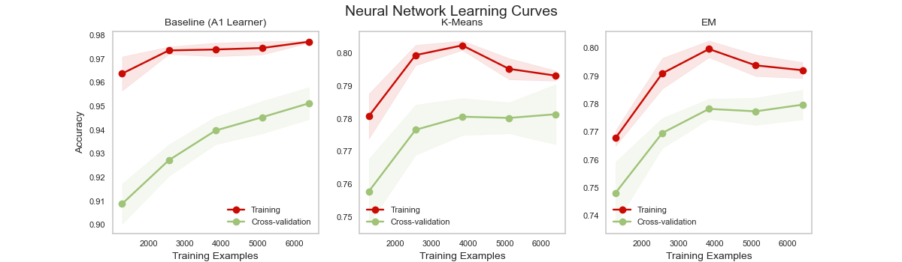

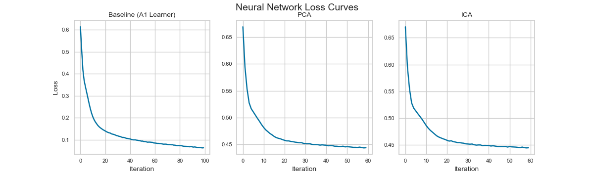

These results show a correlation between the number of features reduced and runtime, accuracy, and loss. Replacing any number of original features with a new feature containing the labels returned from either clustering label does not result in a large drop in accuracy. This illustrates that combining a clustering algorithm and a neural network with the intention of the clustering algorithm performing some preprocessing on the data to speed up neural network runtime is a feasible approach, especially as dataset size increases. For much larger datasets, we would expect to see a much larger decrease in runtime for with increasing number of reduced features. The learning and loss curves also have similar shapes to those of the base learner from assignment 1, showing that using clustering algorithms in this manner does not contribute to under or overfitting the data.

## Conclusion

In conclusion, the dimensionality reduction algorithms discussed in this paper are feasible methods for decreasing computational cost of both supervised and unsupervised learners, with each algorithm having strengths and weaknesses when dealing with various problem types. Furthermore, by projecting the data into a new space, it is possible that such a new space contains stronger correlations between features that can result in improved accuracy in learners as well. Clustering algorithms are a valid method for unsupervised learning that can cluster simple and complicated datasets containing a variety of features and distributions. They can also be used as a preprocessing method for reducing runtimes by removing less valuable features and replacing them with cluster labels instead, which holds significant value in reducing runtime as dataset complexity increases. If using these two types of algorithms in combination, careful consideration should be taken for the datasets they are used for as well as to make sure the algorithms don't contrast each other too much in terms of how they calculate solutions.

## References
* mlrose documentation/examples
* Piazza discussions/Office Hour notes
* Modules/Lectures
* Randomized Local Search as Successive Estimation of Probability Densities, Charles L. Isbell, Jr
* Simulated Annealing and the Knapsack Problem, Benjamin Misch
* Removing the Genetics from the Standard Genetic Algorithm, Shumeet Baluja & Rich Caruana
* https://www.methodology.psu.edu/resources/AIC-vs-BIC/