# Machine Learning: CS 7641 OMS
# Assignment 4 - Markov Decision Processes
Name: Austin Ard  &nbsp;&nbsp;&nbsp;&nbsp;      GT ID: aard6

<!---
To generate a PDF:
pandoc report.md -s -o report.pdf -V fontsize=11pt
-->

## Introduction
This report used the MDPToolbox Python module to analyze the performance of 2 Markov Decision Processes (Value Iteration and Policy Iteration) and 1 reinforcement learning algorithm (Q-Learning). These algorithms solved 2 different problems for analysis: the frozen lake problem and the forest management problem. These problems are interesting because of their different properties. The frozen lake problem is a grid-world problem in which rewards are scarce because the only states that contain rewards are the hole states and the goal states, and the forest management problem is a non-grid world problem that contains a possible reward at every state except for the starting state.

## Frozen Lake

The frozen lake problem is a grid-world problem that represents the challenge of moving from one side of a frozen lake to the other while avoiding dangerous holes in the ice. Furthermore, since the ice is slippery, there is only a 50% chance that the agent will move in the direction it intended and a 25% chance it will accidentally move to 1 of the 2 adjacent directions instead. The rewards for falling in a hole are -1 and the reward for reaching the goal state is 1. This report primarily looks at 2 frozen lake grids: one grid contains 100 states and the other contains 2500 states. For frozen lake, any symmetry across the diagonal of the space that connects the starting state and the goal state could result in 2 optimal policies.

The main hyperparameters tuned for both policy iteration and value iteration are the discount factor (gamma) and epsilon. The discount factor scales the value function based on the rewards of future actions, with a higher discount factor putting higher emphasis on future actions. Epsilon is the stopping criteria with respect to the value function, in which the criteria is met when the max difference between the previous and current value functions is less than epsilon. Basing the stopping criteria on value function instead of policy was the selected method because there could be multiple optimal policies depending on the symmetry of the frozen lake grid, so converging to a value function provides more consistent results. Once the optimal value function is found, there will be a corresponding optimal policy to go with it. Below are tuning plot examples for the smaller problem size.

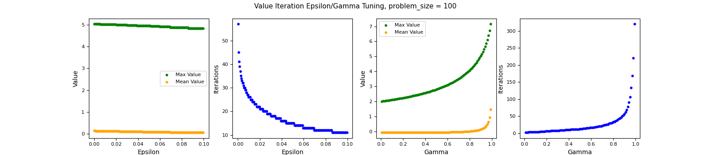

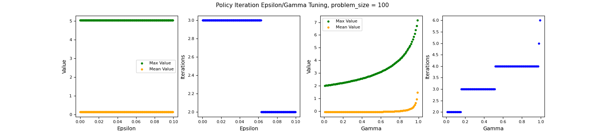

Increasing epsilon for VI decreases convergence iterations and slightly reduces mean and max values because a larger epsilon represents a looser stopping criteria on the value function, causing the algorithm to terminate sooner. Epsilon has little to no effect on policy iteration because it is converging to a policy, so the stopping criteria of stopping when the policy is no longer changing occurs before the value function convergence stopping criteria for most cases. Gamma affects both algorithms similarly in that a higher gamma results in higher mean and max values, but also results in more iterations needed to converge. Increasing gamma results in higher max and mean value because there is a higher value placed on future actions. Since the future actions have more value, the algorithms need have more to consider when trying to converge, so the number of convergence iterations increases as well.

### VI/PI Complexity Analysis

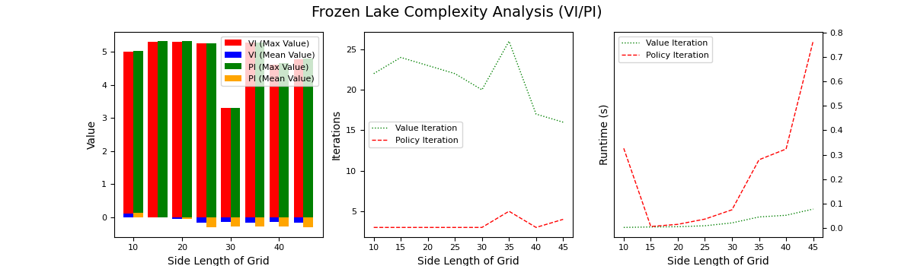

Both algorithms performed similarly in terms of max value for each problem size. Mean value for VI started getting higher than mean value for PI at higher problem sizes. Number of iterations for VI showed slight decrease as problem size increased, whereas PI iterations stayed the same. Runtime increased slower with increasing problem size for VI than for PI.

### VI/PI Performance Analysis

Below are plots showing performance and convergence behavior for both of the primary problem sizes (100 and 2500). Below are also the optimal policies returned by each algorithm for each problem size.

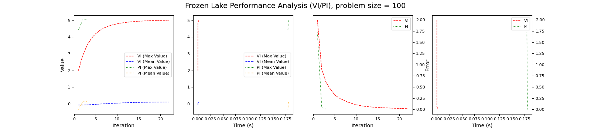

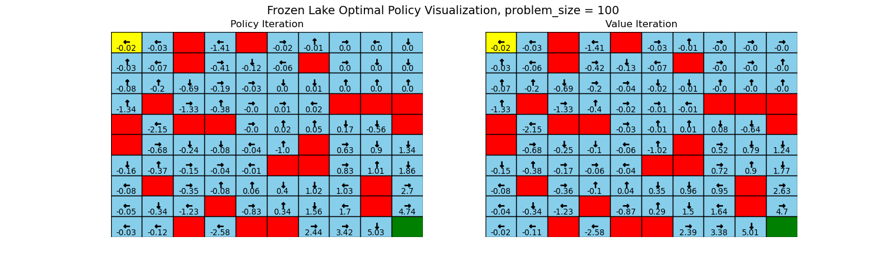

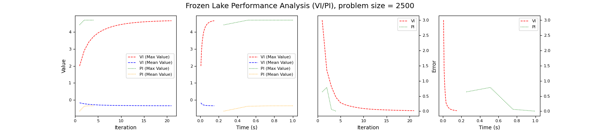

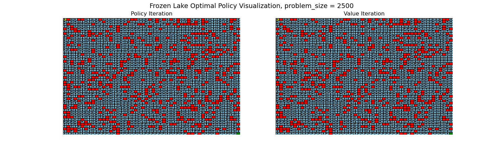

PI converges in fewer iterations than VI for both problem sizes. PI makes direct changes to the policy which represents actions at each state, whereas VI makes direct changes to the value function which represents values at each state. Since there are fewer action possibilities than there are value possibilities for each state, PI is able to extract the imporatant information regarding possible actions in fewer steps than VI. However, PI converges in a longer runtime than VI for both problem sizes. Both algorithms have a policy evaluation step in their loops, but VI only worries about updating the value function while PI has to do an extra policy improvement step which causes each iteration to have longer runtimes. As a result, PI doesn't scale as well as VI in terms of runtime as problem size increases because the added computational complexity of this extra step gets compounded even further. VI and PI almost converged to the same policy for the smaller problem size, with the upper right corner being the difference. This is because VI preferred to choose actions that moved away from holes rather than close to goal like PI did in tricky areas of the problem space, such as the isolated corner in the top right of the small map. This is because value iteration puts more emphasis on the individual values of each state, and since the holes have a negative reward, VI puts more effort to avoid these on a smaller scale. PI adjusts the policy as a whole, so it keeps the larger picture in mind. This would indicate that while PI takes a longer runtime to converge, it can converge to a more globally optimal solution than VI in far fewer iterations for problems that have negative rewards scattered throughout the search space. There were more differences between the converged policies for the larger problem size. While the policies were similar in the majority of places, there were some areas of the grid in which holes created a ring around a group of frozen states, and in these situations the policy iteration tended to prefer actions that moved closer to the goal state while value iteration tended to prefer actions that moved away from the surrounding holes, for the same reasons as described previously.

### Q-Learning

The main hyperparameters tuned were epsilon decay and discount rate (gamma). Epsilon is the probability that the learner will take a random action at each iteration, so it is a measure of the exploration strategy of the learner, where high epsilon puts more emphasis on exploration and low epsilon puts more emphasis on exploitation. Epsilon decay is a measure of how fast the epsilon decays, with higher epsilon decay meaning the epsilon decays slower. Discount factor for QL is the same as the discount factor for VI and PI, with a higher discount factor scaling the value of future actions more. For convergence, we choose a similar criteria to PI and VI in which after the value function starts changing less than the stopping criteria, we have achieved convergence. By setting the convergence to something similar to PI and VI, this allows for better comparison between them all. Below are tuning plot examples for the smaller problem size.

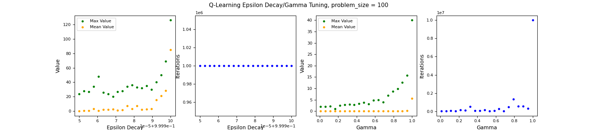

Maybe talk about for a fixed stopping criteria, different epsilon decays result in different number of iterations due to different variances in exploration strategy. Higher epsilon decay results in more exploration, so the value function is more likely to change more often, so takes longer to meet value function convergence criteria. In theory, an infinitely strict stopping criteria would lead to always running for the max number of iterations allowed, which would always favor a pure exploration strategy?

Higher epsilon decay results in higher mean and max values for a constant nubmer of iterations because the learner is performing more exploration throughout the run. For lower values of epsilon decay resulting in lower values, the learner hasn't had enough opportunities to explore all possible state action pairs, so it begins exploiting based on an incomplete picture of the problem. Higher gamma results in faster runtimes as well as higher mean values at convergence. Since the frozen lake problem has sparse rewards, a higher gamma causes the algorithm to behave more opportunisticly by maximizing the learning effect when an action that results in a reward is found and putting more emphasis on the future values of a given state action pair. This requires the QL algorithm to visit a specific state-action pair fewer times to learn its value while also keeping future actions in mind.

### QL Complexity Analysis

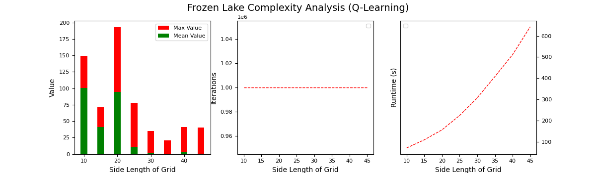

For increasing problem size, runtime increases for a constant number of iterations due to increased size of the Q matrix. Mean and max value also decrease with increasing problem size showing that QL struggles with larger problem sizes. Since a larger frozen lake problem results in more holes for QL to fall and force it back to the start state, its even more difficult for the algorithm to explore the entire space. This is mostly highlighted by the drop in max values because the max value should be similar for all problem sizes, so the drop indicates that the learner wasn't able to explore states near the goal as often. Also, since the holes have a negative reward and there are more holes in the larger map, the values of the states farther away from the goal will naturally decrease, causing the mean value of all states to drop as well.

### QL Performance Analysis

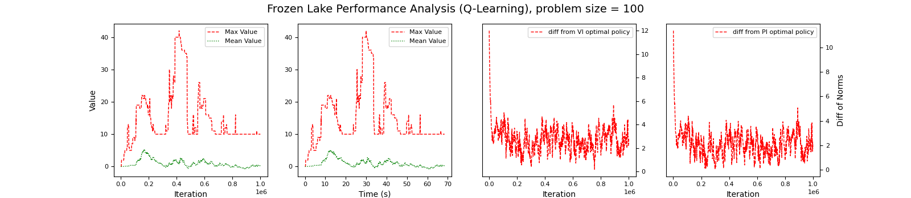

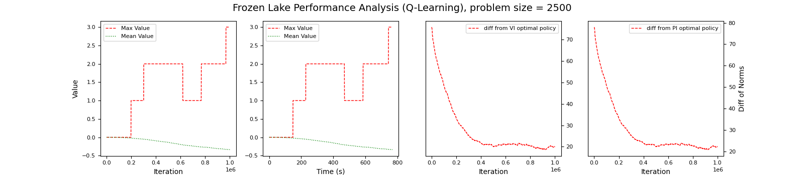

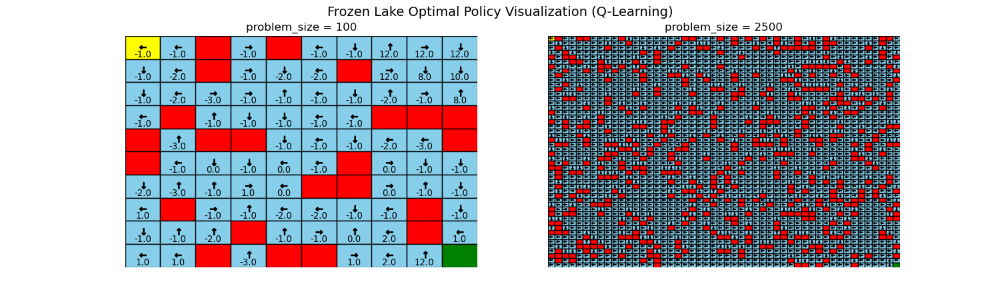

For the smaller size, QL returns a policy that is not too far from the VI and PI optimal policies, although it takes significantly more iterations and runtime. Since QL doesn't know the full reward matrix like VI and PI, it is substantially more difficult for it to learn the optimal policy because it has to trial and error its way through the state space. This struggle is even more apparent in the large problem size, in which the policy is significantly different from the VI and PI policies. The stochasticity is also a problem for QL because if the QL algorithm learns that an action from a certain state that doesn't intend to move into hole results in falling that hole accidentally, the Q matrix could update to assume that this move ends up being bad. Since the policy is initialized with all 0's and the action 'LEFT' corresponds to action 0, the abundance of left arrows in the large policy most likely indicate that all of those spaces were seldom visited if at all. In theory an infinite number of iterations with a heavy exploration strategy would find an optimal policy, but the amount of iterations needed to solve for such a large problem would result in extremely long runtimes.

## Forest Management

The forest management problem is a non-grid world problem like frozen lake in which the states represent time intervals instead of positions in space. The starting state represents the beginning of the forests growth cycle in which there is no trees, and each state afterwards indicates that another time interval has passed. The goal is to maximize the profit from cutting down the forest and selling the wood while also wanting the forest to reach full maturity, represented by the final state. There is a reward of 1 for cutting and a reward of 0 for waiting at any intermediate time interval and a reward of 2 for cutting and a reward for 4 for waiting at the final state. Cutting at any state returns the forest back to the initial state. There is also a 10% chance at every state that the forest will burn down and return to the start state as well. This report primarily looks at 2 forest management timelines: one grid contains 100 time intervals (states) and the other contains 2500 time intervals (states). The forest has only 1 optimal policy in which the optimal action is to wait as you get closer to the final state. The distance away from the final state that starting to wait becomes optimal depends on the chance that the forest will burn down.

The main hyperparameters tuned for VI and PI were the same as described in the frozen lake section above: epsilon and gamma. Below are tuning plot examples for the smaller problem size.

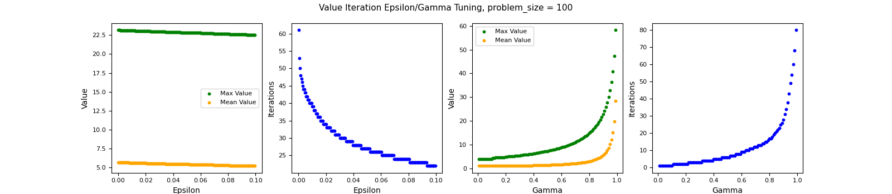

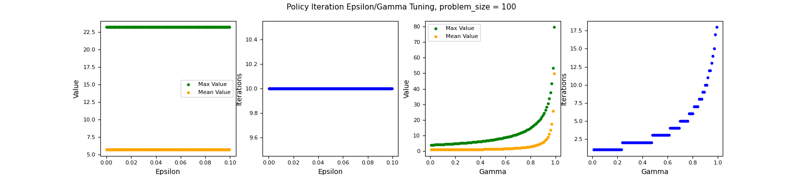

Increasing epsilon for VI decreases convergence iterations and slightly reduces mean and max values because a larger epsilon represents a looser stopping criteria on the value function, causing the algorithm to terminate sooner. Epsilon has little to no effect on policy iteration because it is converging to a policy, so the stopping criteria of stopping when the policy is no longer changing occurs before the value function convergence stopping criteria for most cases. Gamma affects both algorithms similarly in that a higher gamma results in higher mean and max values, but also results in more iterations needed to converge. Increasing gamma results in higher max and mean value because there is a higher value placed on future actions. Since the future actions have more value, the algorithms need have more to consider when trying to converge, so the number of convergence iterations increases as well.

### VI/PI Complexity Analysis

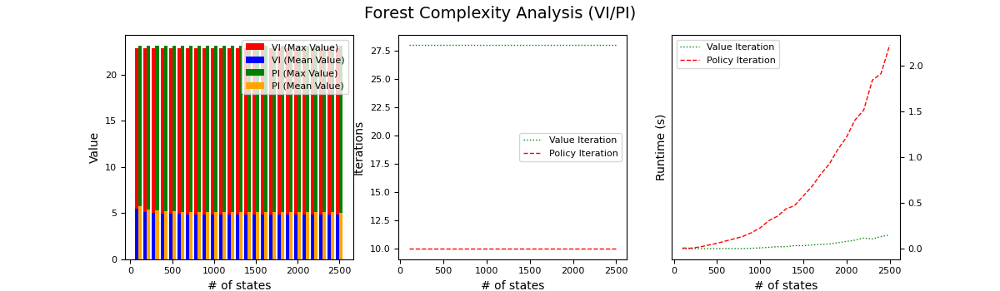

Both VI and PI return the same policy and the number of iterations does not scale with increasing problem size. Since there are only 2 actions instead of 4 like there was for the frozen lake problem, the learners have less options when choosing how to update the policy at each iteration, meaning they hone in on the optimal policy easier and in a more consistent number of iterations. Furthermore, the optimal policy involves cutting at every time interval except when approacing the final time interval. Since the forest has a 10% percent chance of burning down at each time interval, the optimal policy involves only waiting for the final state if you are within 10 states of it. Since this is constant, each learner takes the same number of iterations to adjust the final 10 states to wait no matter the problem size, indicating that the number of iterations required for convergence is dependent on the definition of the problem.

### VI/PI Performance Analysis

Below are plots showing performance and convergence behavior for both of the primary problem sizes (100 and 2500). Below are also the optimal policies returned by each algorithm for each problem size.

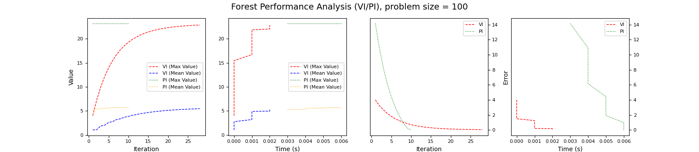

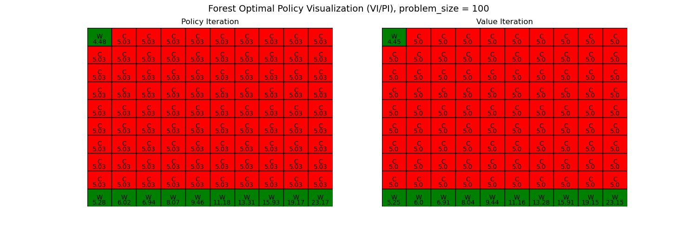

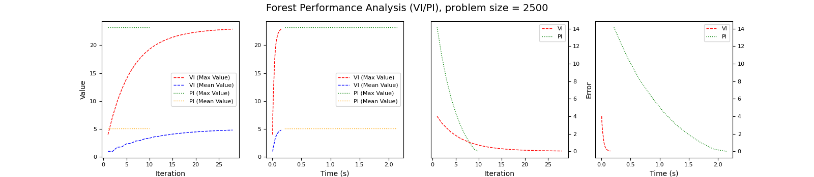

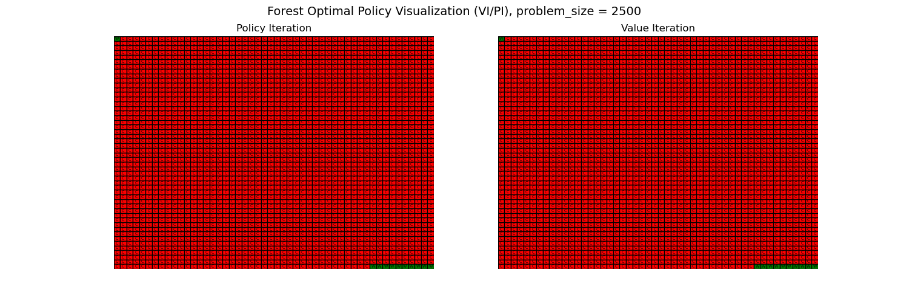

Both VI and PI converge to the same answer for both problem sizes, with PI converging in fewer iterations and VI converging in a shorter runtime. The difference in runtimes between the two is larger for the larger problem size, showing that the computational intensity of PI doesn't scale as well as VI with increasing problem size. However, the difference in runtimes and iteration convergences for the larger problem size between the two algorithms is smaller for the frozen lake problem then it is for the forest problem. The main difference for this between the two problems is the size of the action space, where there are 4 actions for frozen lake and 2 actions for forest. This highlights that the number of possible actions at each state has an effect on the runtime and number of convergence iterations, with PI scaling better with increasing the number of actions.
Here we discuss performance. Both VI and PI return the same optimal policies for both the small and large forest problem sizes. PI converges in fewer iterations but has longer runtimes for both problem sizes.

### Q-Learning

The main hyperparameters tuned for QL were the same as described in the frozen lake section above: epsilon decay and gamma. Below are tuning plot examples for the smaller problem size.

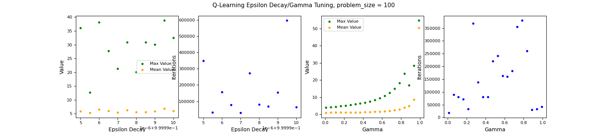

As epsilon decay approached 1 (signifying pure exploration), the max/mean values remained roughly the same for the small problem size, but the number of iterations trended downwards. Increasing discount factor had a similar effect to PI/VI in that as it approached 1, the max/mean values as well as the number of iterations and runtimes increased drastically. In order to avoid a bad tradeoff for runtime and computational intensity, we use an elbow method to select a gamma at the point of maximum curvature around 0.9.

### QL Complexity Analysis

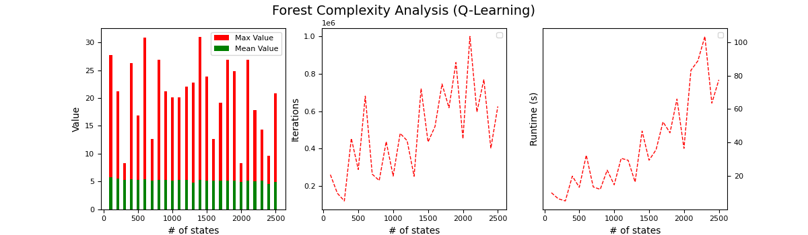

QL performs consistently in terms of mean value for increasing problem size by only showing a slight negative gradient. The max values jump all over the place indicating that QL is not a consistent method for returning optimal solutions, as the optimal solution should have roughly the same max value for all problem sizes as indicated by the PI/VI complexity analysis graph discussed earlier. The number of convergence iterations and runtime also show an upward trend with increasing problem size showing that the QL algorithm is indeed having to spend more time and effort learning a larger problem size as expected.

### QL Performance Analysis

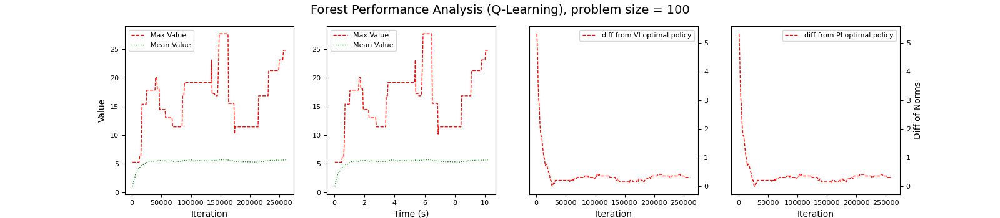

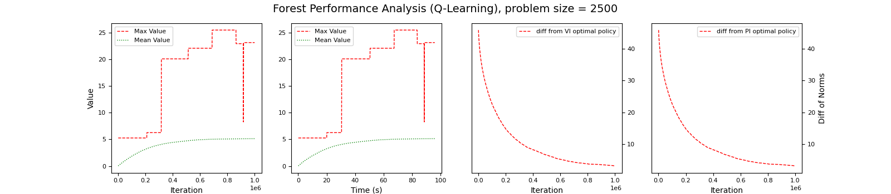

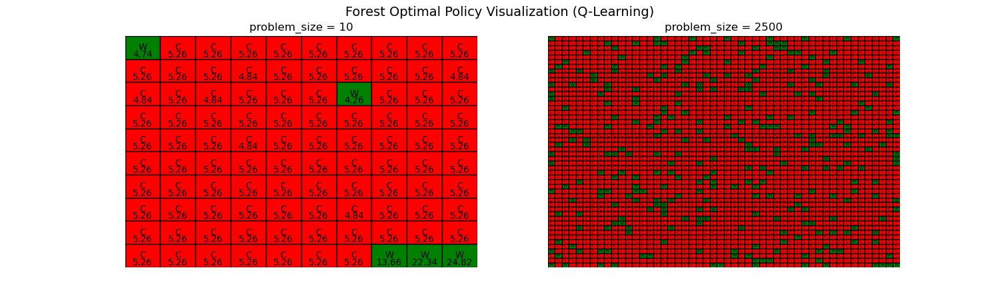

QL does decently well for the smaller problem size and struggles more for the larger problem size. The forest problem is difficult for QL because there is the possiblity at every state that the resulting action will send the learner back to the initial state, making it difficult to ever make it to the highest valued and rewarding state at the very end. QL with a stronger emphasis on exploration can overcome this to some extent as shown in the smaller problem size. The green squares not near the end state for both problem sizes show that the learner can get unlucky and learn incorrect strategies based on immediate reward. Since there is an exploration strategy involved, it's possible that at a certain state, the learner will continually randomly select the suboptimal option and before it has time to learn that it's suboptimal, the learner has already entered the exploitation phase. This effect will be exaggerated for a larger state space in which it's more difficult for the learner to explore all of the states, as indicated by the green wait sqaures scattered throughout the large problem policy.

For the smaller forest problem size, QL performs comparably to VI and PI in terms of mean and max value, but has significantly higher runtimes. Since the problem has intermediate rewards at all but 1 state, the QL algorithm receives more feedback at each learning step and converges to a solution in a reasonable time. However, the optimal policy from QL does not match those from VI and PI for both the small and large problem sizes. The intermediate rewards allow for easier convergence, but they also distract the QL algorithm from learning that waiting is more valuable as you get closer to the final time interval.

## Conclusion

In conclusion, both value iteration and policy iteration are good algorithms for solving MDPs of all sizes, with value iteration converging faster in terms of runtime and policy iteration converging in far fewer iterations. Q-Learning is a sensitive reinforcement learning algorithm that performs comparably to VI and PI in terms of optimal policy for smaller problems with well defined rewards, but struggles more with larger problems and problems with trickier definition parameters, such as sparce rewards or transition matrices that send the algorithm back to the starting state frequently.

## References
## References
* MDPToolbox documentation/examples
* Piazza discussions/Office Hour notes
* Modules/Lectures
* Reinforcement Learning: An Introduction, Sutton & Barto
* Fundamental Iterative Methods of Reinforcement Learning, Nathan Lambert